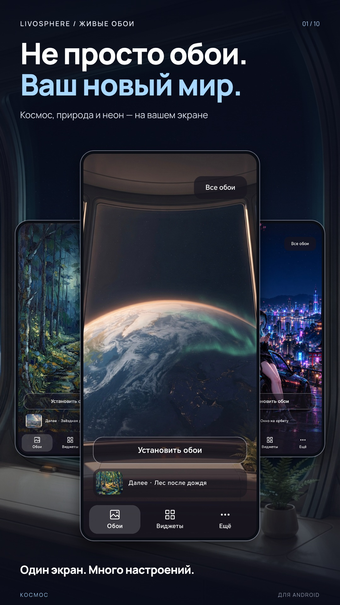
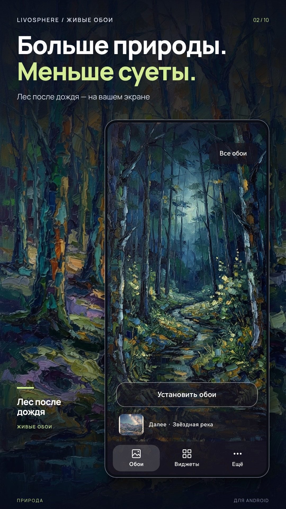
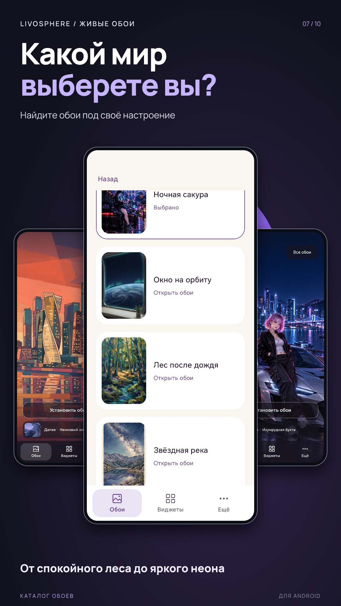
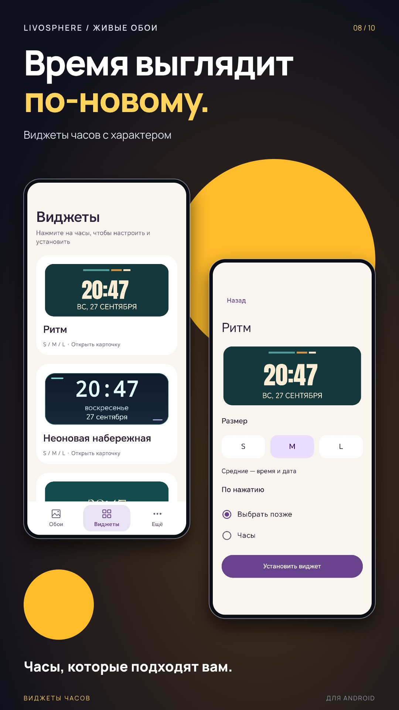
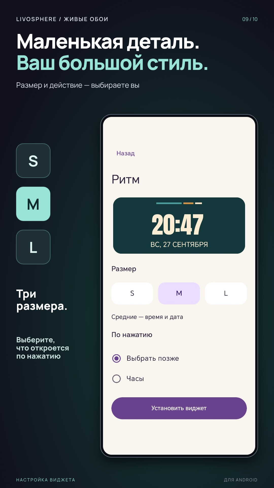

# Livosphere

Live wallpapers and clock widgets for Android, created by **Yakov Weber (Вебер Яков)**.

Browse a local collection of illustrated worlds, apply a wallpaper, and add clocks in S, M or L. Wallpapers and widgets work independently: mix them across collections or use either on its own.

[Русский](README.ru.md) · [Build](docs/BUILDING.md) · [Architecture](docs/architecture/README.md) · [Screen specifications](docs/README.md) · [Contribute](CONTRIBUTING.md)

[Privacy policy (Russian)](https://singeltonattero.github.io/Livosphere-public/privacy/)

## A look inside

<p align="center">
  
  
</p>
<p align="center">
  
  
  
</p>

These are existing RuStore promotional compositions made from app screenshots and artwork, rather than raw screen captures. Their Russian captions are retained from the store materials. [Image sources](docs/images/README.md).

## What it does

- A bundled catalogue: no account or online theme download.
- Live wallpapers with local-time phases and scene-specific effects.
- Independent clock widgets with per-instance configuration.
- System wallpaper preview and widget pin/picker flows.
- Reduced/off effect policies and lifecycle-aware rendering.

The current manifests select 13 public collections. The product targets Android phones. Launcher behaviour, lock-screen support and battery results depend on the device and need separate validation.

## Get the app

**RuStore publication is in progress.**

[RuStore app link — to be added after the listing is available](#rustore-listing)

<a id="rustore-listing"></a>
<!-- RUSTORE_APP_URL: replace the placeholder link above with the verified application listing URL. -->
The public listing URL has not yet been recorded here. A store submission does not establish availability; a local build is not the store-distributed release.

## Build locally

Install JDK 17 and Android SDK Platform 37, then run from the repository root:

```sh
make doctor
make phone
make phone-install PHONE_SERIAL=DEVICE_SERIAL
```

Enable USB debugging and authorize the selected device before installation.

Debug APK: `android/hub/app/build/outputs/apk/debug/app-debug.apk`.
No owner signing key is required for this build. The first build downloads Gradle and Maven dependencies. See [building and testing](docs/BUILDING.md) for prerequisites, checks and device installation.

## For developers

Kotlin, Jetpack Compose, Hilt, DataStore, Android WallpaperService and AppWidget/RemoteViews. Versions are pinned in `android/gradle/libs.versions.toml` and the Gradle wrapper.

[Screen specifications](docs/README.md) describe what each screen does and where to change it. [Architecture](docs/architecture/README.md) explains the modules and system boundaries. [Content development](docs/CONTENT.md) covers manifests, assets and approvals. [Device testing](docs/TESTING.md) gives a manual check route.

## License and artwork

Code and project-authored documentation: [MIT](LICENSE), copyright © 2026 Yakov Weber. Keep the copyright and license notice when reusing the code.

**Artwork is separately licensed.** Wallpapers, illustrations, app icons, widget artwork and promotional images are excluded from MIT. Local build/testing is permitted; reuse or redistribution of that artwork requires the author's written permission. See [artwork terms](ASSET-LICENSE.md). Third-party fonts and bundled tools retain their own [licenses](THIRD-PARTY-NOTICES.md).
