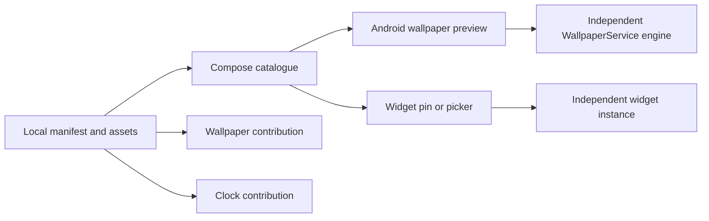

# Architecture

Livosphere has three independent Android surfaces: the Compose catalogue, WallpaperService engines, and AppWidget clocks. Selecting content in the catalogue does not establish that it is applied. System flows and host confirmations supply separate facts.

## Modules

| Area | Responsibility |
| --- | --- |
| `android/hub/app` | Compose UI, application composition and Android adapters |
| `android/hub/domain` | UI state, actions and policies outside the Android UI |
| `android/core/contract` | Descriptors, values and ports shared by surfaces |
| `android/core/settings` | Owner-scoped persisted preferences |
| `android/wallpapers/engine` | Phases, render loop and lifecycle policies |
| `android/wallpapers/neon`, `static`, `fixture` | Scene-specific and test implementations |
| `android/widgets/runtime` | Native clock behaviour and instance lifecycle |
| `android/sets/<id>` | Manifests, source assets and contributions |
| `android/build-logic` | Parsing, registry generation, asset validation and variant selection |
| `android/quality/macrobenchmark` | Measurement tooling |

## Invariants

Previewing B must not mutate active wallpaper A. Each widget ID owns its settings; editing or deleting one does not alter its neighbours. Wallpapers and clocks can be combined across collections. Hub colours, typography and components are independent of the displayed artwork.

Wallpaper engines work without an Activity, follow local time, and stop or reduce work according to visibility, effect selection and platform power policies. Clock widgets use Android host capabilities and RemoteViews; HTML previews cannot establish those capabilities. Lock-screen support is host-dependent.

The local manifest is the source for contribution selection and generated resources. Do not hand-edit generated registries. Use accepted revisions, asset provenance and the validator when adding content. [Content guide](../CONTENT.md).

Kotlin, Compose, Hilt, DataStore and their versions are pinned in the repository. There is no runtime catalogue download or backend in the current scope. Release evidence is bound to exact artifact bytes; rebuilding changes the candidate and cannot inherit previous device results automatically.

UI behaviour is documented in [screen specifications](../README.md). Build and installation commands are in [BUILDING](../BUILDING.md).
