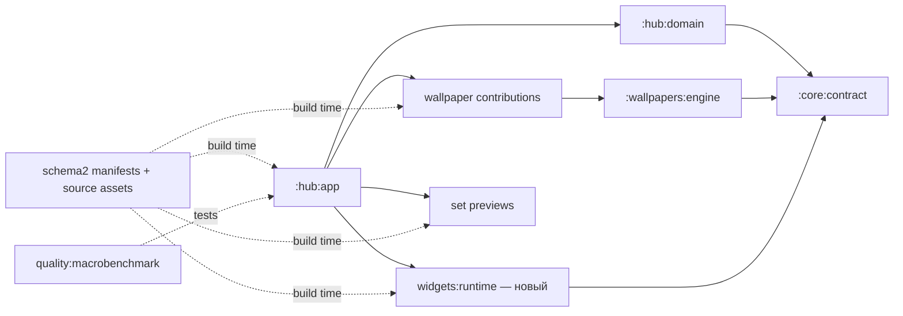
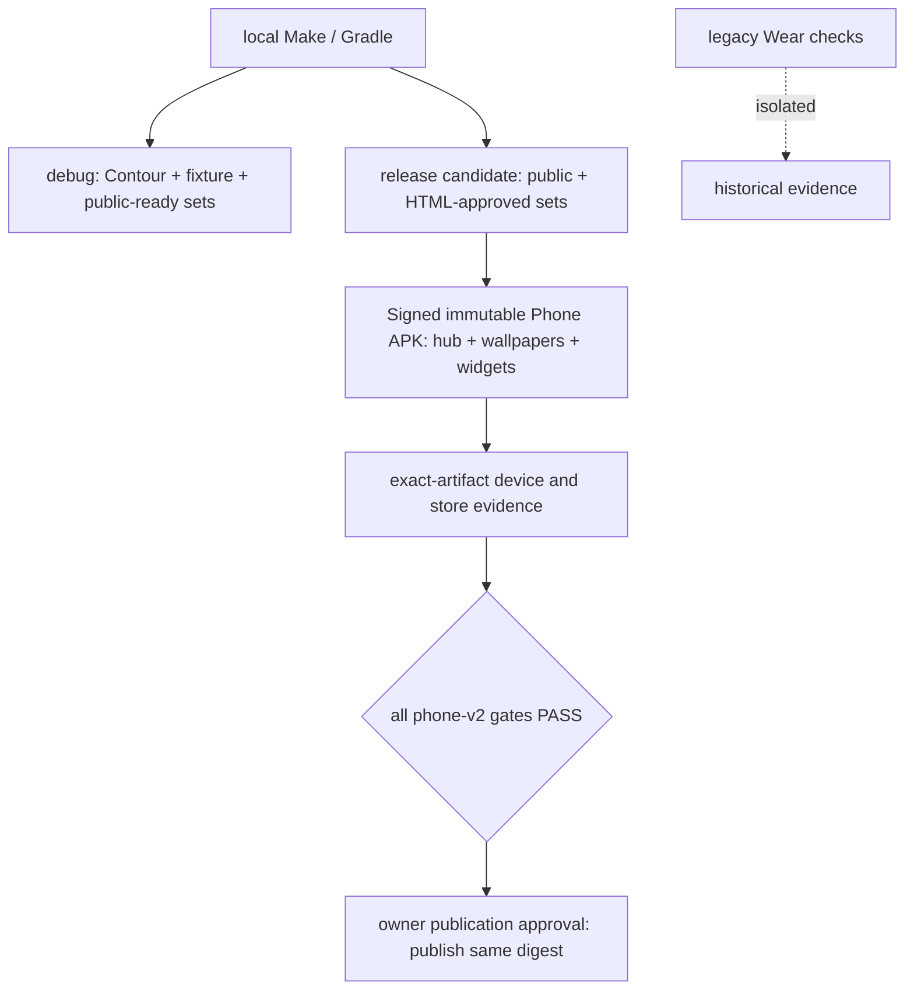

# Architecture Spine — Livosphere

## Design Paradigm

Сохраняется surface-first hexagonal architecture: чистые policies и contracts внутри, Android adapters снаружи, единственный composition root в `:hub:app`. На момент утверждения этой дельты код реализовывал прежний baseline; нижеследующая дельта — контракт реализации Epics8–15. Текущее выполнение определяется sprint state. Старые AD-1…AD-22 сохраняют ID, новые решения начинаются с AD-23.

## Invariants & Rules

### AD-1 — Независимые поверхности [ADOPTED]

- **Binds:** все phone-эпики.
- **Prevents:** связанность жизненных циклов и политик.
- **Rule:** Surface-first hexagonal architecture: hub, wallpaper и clock widget — отдельные границы. Контракты направлены внутрь. Wear OS исключён решением владельца от [27 сентября](../../decision-2026-09-27-remove-wear.md).

### AD-2 — Один composition root [ADOPTED]

- **Binds:** hub, wallpaper, widgets.
- **Prevents:** обратные зависимости от поверхностей к UI.
- **Rule:** Единственный Android composition root — :hub:app. Он связывает domain, adapters, wallpaper и widgets. Поверхности не зависят от hub Activity/ViewModel, друг от друга или от навигации; необходимые ports находятся в :core:contract.

### AD-3 — Compile-time наборы [ADOPTED]

- **Binds:** Epics 8, 9, 12, 13.
- **Prevents:** ручные реестры и коллизии ID.
- **Rule:** Один manifest на набор — sole contribution authority; телефонные schema 2–4 описаны в phone-contracts.md. Целевой контракт допускает wallpaper-only, widget-only и комплект; обязательны ресурсы, previews, версии и применимые approvals присутствующих частей. Текущая schema2 ещё требует пару; её версионированное расширение с сохранением старых IDs/settings входит в 13.3. Registry, ресурсы и упаковка генерируются только из явно включённых manifests; runtime plugin discovery отсутствует.

### AD-4 — Одна телефонная поставка [ADOPTED]

- **Binds:** Epics 8, 14.
- **Prevents:** зависимость телефонного релиза от иных платформ.
- **Rule:** Phone artifact содержит hub, WallpaperService-компоненты и AppWidget providers/resources. Обои и виджеты устанавливаются с приложением и активируются пользователем независимо.

### AD-5 — Единственный владелец состояния [ADOPTED]

- **Binds:** все runtime-эпики.
- **Prevents:** рассинхронизация authoritative copies.
- **Rule:** Mutable state имеет одного writer; immutable state вниз, typed actions вверх. Registry, настройки и свежие platform facts имеют отдельные owners; UI stores только проецируют их. Рассматриваемый набор, факты применённых обоев и конфигурации appWidgetId разделены по AD-23.

### AD-6 — TEA и явные effects [ADOPTED]

- **Binds:** hub/domain и wallpaper state.
- **Prevents:** логика в composables и скрытые side effects.
- **Rule:** ViewModel хранит pure reducer/store и StateFlow; command handlers возвращают typed actions. Для wallpaper — та же дисциплина без ViewModel. AppWidget callbacks выполняют короткие команды через общий repository. Третья MVI-библиотека не добавляется.

### AD-7 — Только собственные данные в persistence [ADOPTED]

- **Binds:** Epics 8–11.
- **Prevents:** устаревшая platform truth и два DataStore writer.
- **Rule:** Typed DataStore за repositories хранит собственные preferences. WallpaperSettingsRepository и WidgetSettingsRepository объявлены в :core:contract; единственные adapters связываются composition root. Обновления атомарны и сериализованы. Installed/active/host capability не сохраняются как доказанная истина. Room не вводится.

### AD-8 — Lean Clean [ADOPTED]

- **Binds:** hub/domain.
- **Prevents:** Android-зависимости в политике и лишние слои.
- **Rule:** Pure Kotlin :hub:domain содержит reducers, policies и ports. Owned data проходит repositories; metadata — SetRegistry; внешние действия — gateways. Use case нужен для повторяемой оркестрации/инварианта, а не для каждого метода.

### AD-9 — Типизированные ошибки [ADOPTED]

- **Binds:** все fallible boundaries.
- **Prevents:** проглоченная отмена и необработанные состояния.
- **Rule:** Fallible APIs возвращают Outcome<Value, Failure>, потоки — Flow<Outcome<Value, Failure>>. UNKNOWN, UNSUPPORTED, POLICY_BLOCKED, cancellation — явные product states. CancellationException пробрасывается; неожиданные ошибки санитизируются и получают incidentId. Pure total functions не оборачиваются в Outcome.

### AD-10 — Один Hilt graph [ADOPTED]

- **Binds:** Android runtime.
- **Prevents:** service locators и привязка к Activity.
- **Rule:** @HiltAndroidApp живёт в :hub:app; constructor injection/@Binds — defaults. Service/provider/configuration adapters получают зависимости через Android component entry points и application scope. Domain не знает Android/Hilt; ресурсы не зависят от DI.

### AD-11 — Автономные wallpaper Engine [ADOPTED]

- **Binds:** Epics 8, 10.
- **Prevents:** preview B меняет применённые A.
- **Rule:** Каждый wallpaper contribution имеет устойчивый отдельный WallpaperService component и общий engine; module wrapper фиксирует wallpaperId, а не читает глобальный selection. Default app process, без android:process. Каждый Engine владеет mutable render state и временным preview state. Cold-start после первого unlock не требует открытия hub; до unlock нет обещания Direct Boot. Точный алгоритм — phone-contracts.md.

### AD-12 — Canvas-first renderer [ADOPTED]

- **Binds:** Epic 10.
- **Prevents:** невидимая отрисовка и преждевременная смена renderer.
- **Rule:** SurfaceHolder принадлежит Engine; WallpaperRenderer заменяем. Canvas работает off-main только на valid visible surface; stop/cleanup детерминированы. Время анимации независимо от числа кадров. OpenGL/AGSL рассматривается только после измеримого провала принятого бюджета либо подтверждённой невозможности одобренного эффекта.

### AD-13 — Численные quality budgets [ADOPTED]

- **Binds:** Epics 10, 11, 14.
- **Prevents:** субъективный PASS и дребезг low battery.
- **Rule:** Phone: 30 fps; ≥95% presented intervals ≤34 ms, P99 ≤50 ms, warm-stall ≤100 ms; tap/swipe P95 ≤100 ms. Energy delta normal ≤10%, reduced ≤5% к сопоставимому static baseline. Reduced входит при saver или battery≤20%, выходит при saver off и battery≥25%; UNKNOWN — reduced. Это сохранённые критерии, не измерения. Дополнительные widget/combined budgets в phone-contracts.md — делегированные критерии до замеров; прежний WFF-бюджет отложен вместе с Wear.

### AD-14 — Платформенный минимум [ADOPTED]

- **Binds:** Epics 8, 11, 14.
- **Prevents:** minSdk ошибочно считается проверкой OEM.
- **Rule:** Phone minSdk 29 / targetSdk 36 / compileSdk 37 сохраняются. Widget API29/30 fallback обязателен; API31+ sizing и host-specific capabilities — через проверяемые adapters. Совместимость подтверждается на конкретных model/OS/build/launcher; Pixel, Samsung и HONOR остаются базовыми phone-семействами проверки. Исторические Wear-параметры не входят в активную архитектуру.

### AD-15 — Сохранённый build baseline [ADOPTED]

- **Binds:** все модули.
- **Prevents:** version drift и случайные upgrades.
- **Rule:** Версии задаёт android/gradle/libs.versions.toml, conventions — build-logic. AGP9 built-in Kotlin; нет org.jetbrains.kotlin.android/kapt; Compose compiler только в Compose modules; KSP2. Значения Stack сверены с текущим кодом. В этом пересмотре зависимости не обновляются; новый AppWidget использует platform APIs. Любое последующее обновление требует отдельной проверки совместимости и build smoke.

### AD-16 — Evidence у владельца поведения [ADOPTED]

- **Binds:** все эпики, особенно 14.
- **Prevents:** новый scope наследует старые PASS.
- **Rule:** Тесты остаются в owning modules; core/testing предоставляет fixtures, quality/macrobenchmark — device traces. Domain transitions/failures, hub semantics, wallpaper lifecycle/frames, widget RemoteViews/config/restore имеют разные проверки. Release evidence привязан к digest/versionCode, setId/revision, model/OS/build/launcher/host, версии протокола, сценарию, raw digest и результату. Эмулятор не закрывает physical/store gates.

### AD-17 — Локальная observability [ADOPTED]

- **Binds:** Epics 14, 15.
- **Prevents:** скрытая telemetry и чувствительные logs.
- **Rule:** IncidentReporter и trace ports нейтральны к provider. Debug Logcat/trace структурированы; release по умолчанию ничего не передаёт. Отчёт эксперимента строится из store exports и добровольной обратной связи, с указанным способом измерения. Remote provider требует отдельного решения privacy/retention/channel.

### AD-18 — Версия и release profile [ADOPTED]

- **Binds:** Epics 8, 14.
- **Prevents:** публикация непроверенной комбинации.
- **Rule:** productRelease задаёт релиз, set manifest — monotonic setRevision, Android build — monotonic versionCode. Generated release manifest связывает фактический APK/AAB digest и проверенные content revisions. phone-v2 требует phone surfaces и свой evidence index; legacy-phone-wear профиль не переименовывается и не подделывается. READY требует все обязательные gates именно выбранного профиля.

### AD-19 — Local-first Make [ADOPTED]

- **Binds:** Epics 8, 12, 14.
- **Prevents:** обход проверок и секреты в репозитории.
- **Rule:** Make — thin non-interactive fail-fast orchestration над Gradle/validators. Phone targets и legacy Wear checks разделяются в Epic8; release profile обновляется в Epic14. Будущий CI вызывает те же targets. Signing material снаружи repository; builds не вызывают AI/network art generators.

### AD-20 — Navigation 3 shell [ADOPTED]

- **Binds:** Epic 9.
- **Prevents:** второй navigation writer и модуль на экран.
- **Rule:** Single-Activity Compose + typed serializable NavKey + один HubNavigator/rememberNavBackStack save-restore. Screens отправляют actions и не получают navigator. Наборы/Устройства/Настройки — корневые sections; прежний Theme NavKey допустим для сохранения маршрута; локальные collection/detail/widget-config routes не создают Gradle module на экран.

### AD-21 — Source assets и provenance [ADOPTED]

- **Binds:** Epics 8, 12, 13.
- **Prevents:** stale preview и debug-only assets в release.
- **Rule:** sets/<id>/source-assets хранит masters, deterministic exports, provenance и hashes. Build-logic разрешает только manifest-selected exports в generated resources; missing/stale/undeclared — fail. Release фильтрует набор целиком, включая preview, resources и компоненты; Contour не допускается. Художественные approvals связаны с точными ревизиями: image+HTML для wallpaper, HTML S/M/L для widget; у комплекта — применимые approvals частей.

### AD-22 — Безопасность runtime/components [ADOPTED]

- **Binds:** Epics 8–11, 14.
- **Prevents:** утечки корутин, широкая visibility и фоновые циклы.
- **Rule:** Structured concurrency, injected dispatchers/Clock, serial actions, cold recovery из owned data + fresh signals. Debug hooks исключены из release. Нет network client, WorkManager, foreground service, wakelock и exact alarms. Все exported заданы явно: launcher и системная widget configuration Activity exported; WallpaperService — с BIND_WALLPAPER; AppWidgetProvider и внутренние callback receivers non-exported. Внешние IDs/intents проверяются. QUERY_ALL_PACKAGES запрещён; clock apps обнаруживаются адресно по поддержанным clock intents.

### AD-23 — Независимые references и миграция [DELEGATED]

- **Binds:** Epics 8, 9, 11.
- **Prevents:** выбор темы или редактирование одного экземпляра меняет остальные.
- **Rule:** Контракт phone-contracts.md фиксирует browsingSetId, WallpaperPreferences[wallpaperId], наблюдаемые HOME/LOCK facts и WidgetPreferences[appWidgetId]. Widget instance хранит widgetId,size,clockTarget,version; logical references устойчивы между app updates. Миграции атомарны, idempotent, не подставляют другой набор при missing reference. Restore старых widget IDs remap атомарен; удаление одного ID не удаляет общий theme config.

### AD-24 — Часы от системного host [DELEGATED]

- **Binds:** Epic 11.
- **Prevents:** минутные provider polls и promise произвольной анимации.
- **Rule:** AppWidget + native RemoteViews: TextClock для цифрового времени/даты, AnalogClock как ограниченный вариант после early spike. Нет собственного timer/bitmap ticking/continuous widget renderer. updatePeriodMillis=0; framework clock view отвечает за текущее время, provider обновляет конфигурацию и доступные callbacks. У каждого набора один выбранный формат; artistic limitations возвращаются на art/HTML approval до native production.

### AD-25 — Фазы и authored effects [DELEGATED]

- **Binds:** Epic 10.
- **Prevents:** system dark theme подменяет местное время.
- **Rule:** PhasePolicy использует текущее local time/ZoneId: dawn [05:00,08:00), day [08:00,18:00), dusk [18:00,21:00), night [21:00,05:00). Это решение исполнителя. Геолокации нет. При resume/time/date/timezone change пересчитывается фаза без replay; visible Engine планирует естественную границу PhaseScheduler даже при motion=off, hidden/destroy отменяют callback. Каждый wallpaper объявляет объекты/эффекты/триггеры/3 уровня/stop/reduced; эффективные эффекты — пересечение authored уровня с power/reduced/off cap и отдельным tap/swipe toggle.

### AD-26 — Подтверждение системных путей [DELEGATED]

- **Binds:** Epics 9, 11.
- **Prevents:** pin request или возврат объявляются установленным результатом.
- **Rule:** Wallpaper flow открывает ACTION_CHANGE_LIVE_WALLPAPER для конкретного component. Widget flow проверяет isRequestPinAppWidgetSupported; pin callback лишь положительное свидетельство host allocation конкретного ID, отсутствие callback — UNKNOWN. Configuration OK требует сохранённой конфигурации и первого update; cancel не коммитит. Picker fallback доступен. Lock host availability и authentication проверяются на устройстве; HOME доступен независимо от LOCK. Подробный протокол request token/instance reconciliation и единственный per-ID latest-committed RenderCoordinator — phone-contracts.md.

## Consistency Conventions

| Область | Правило |
| --- | --- |
| IDs | lower-kebab set/wallpaper/widget IDs; appWidgetId — host integer, не ID набора. ID не зависит от локализованного имени. |
| State | immutable State, sealed Action/Command/Failure; appWidget callbacks не обходят repository transaction. |
| Время | Clock возвращает Instant; PhasePolicy явно получает ZoneId. UTC — timestamps evidence, local time — фазы и часы. |
| Ресурсы | `ls_<normalized-set-id>_<surface>_`; exported resources и previews хэшируются. Shell UI resources не принадлежат набору. |
| Состояния | UNKNOWN не равно FAIL; bound widget ID не доказывает видимость HOME/LOCK. Свежесть и источник наблюдения обязательны. |
| Дизайн | Hub не наследует токены арта. Wallpaper/widget/set имеют отдельные contracts и approval revisions. |

## Stack

Сверено с текущим version catalog; это сохранённые версии проекта, не заявление о последних версиях рынка.

| Name | Version |
| --- | --- |
| Android compile SDK | 37 |
| Phone min / target SDK | 29 / 36 |
| Android Gradle Plugin | 9.3.2 |
| Gradle Wrapper | 9.5.0 |
| JDK / JVM target | 17 / 17 |
| Kotlin / Compose compiler | 2.3.21 / 2.3.21 |
| Compose BOM | 2026.08.00 |
| Hilt | 2.60.1 |
| AndroidX Hilt | 1.4.0 |
| KSP | 2.3.11 |
| DataStore | 1.2.1 |
| Kotlinx Serialization | 1.11.0 |
| Navigation 3 | 1.1.7 |
| BMad Method | 6.11.0 |

## Structural Seed

Имеющиеся `hub`, `core`, `wallpapers`, `sets`, `build-logic`, `quality` переиспользуются. Новая граница `:widgets:runtime` — Android library с providers, configuration adapters и RemoteViews; шаблоны/exports каждого widget принадлежат соответствующему набору. Если повторяемый domain policy не Android-specific, он находится в `:core:contract` либо существующем pure domain, не в View.

Ни remote backend, ни hosted CI/telemetry provider в этой поставке не нужны. Новые темы доставляются обновлением приложения; локальные manifests не заменяются runtime server catalog.

## Capability → Architecture Map

| Capability / Area | Lives in | Governed by |
| --- | --- | --- |
| CAP-1 — витрина/preview | hub/domain, hub/app, previews | AD-2, 5–10, 20, 23 |
| CAP-2 — wallpaper apply/facts | system gateway, per-wallpaper service | AD-9, 11, 26 |
| CAP-3 — scene/effects | wallpapers/engine + contributions | AD-11–13, 25 |
| CAP-4/CAP-5 — Wear | удалённые модули | archive; вне продукта |
| CAP-6 — settings/help/updates | hub/domain + repositories | AD-5–9, 17, 20 |
| CAP-7 — phone release | build-logic, Make, evidence | AD-4, 14–19, 21–22 |
| CAP-8 — repeatable set pipeline | manifests, local authoring contracts | AD-3, 21 |
| CAP-9 — experiment | manual reports + store exports | AD-16–17 |
| CAP-10 — widgets | widgets/runtime + WidgetSettingsRepository | AD-7, 14, 22–24, 26 |
| CAP-11 — accepted starter collection | set assets and revision approvals | AD-3, 16, 21 |

## Deferred

- Wear OS, старые WFF бюджеты/SP-02/SP-03 и их delivery route: возвращаются только по отдельному scope-решению; old evidence остаётся привязанным к старым artifacts.
- Exact device inventory и физическая поддержка LOCK: Epic11/14 проверяют named models/builds/hosts; неизвестность не блокирует HOME или подготовку разработки.
- Concrete scene art, analog style fit и first-release count: принятый native widget spike, применимые art approvals, затем manifest включения. Минимум одного самостоятельного продукта — уточнённое PRD A-3, не разрешение публиковать debug fixture.
- Release keys/store snapshot и новый phone readiness validator: Epic14. Старый make release не является новым маршрутом до реализации этих stories.
- Пороги новых component metrics: Epic15 до начала пилота; время старта/качество данных фиксируются в протоколе. Нет встроенной аналитики.
- Canvas replacement, отдельный process, новые feature modules, Git LFS и hosted CI — только по измеримой необходимости; они не нужны для начала Epic8 и AppWidget spike.
- Монетизация, Remote Config для анонсов, сеть для доставки тем, AI-конструктор, клавиатура, broad widgets и другие платформы не входят в этот backlog.

## Уточнение производства — 2026-09-17

[Одобренное изменение](../../sprint-change-proposal-2026-09-17.md) переносит развитие общего кода в реальные циклы контента. Общими остаются lifecycle, time/power policies, settings, системные маршруты и упаковка. Artwork, scene renderer и widget layouts принадлежат конкретному продукту. Общий API расширяется при конкретной потребности; скилл не является runtime engine и не обещает любые эффекты без кода. Fixture сохраняется для узких проверок, не имеет самостоятельного плана художественного развития.

Версионированное расширение manifests/catalog запланировано в 13.3, ещё не реализовано. Существующее доказанное поведение Epics 8/11/10.1 сохраняется; повторное чтение документов не переносит его PASS на новые поверхности.
